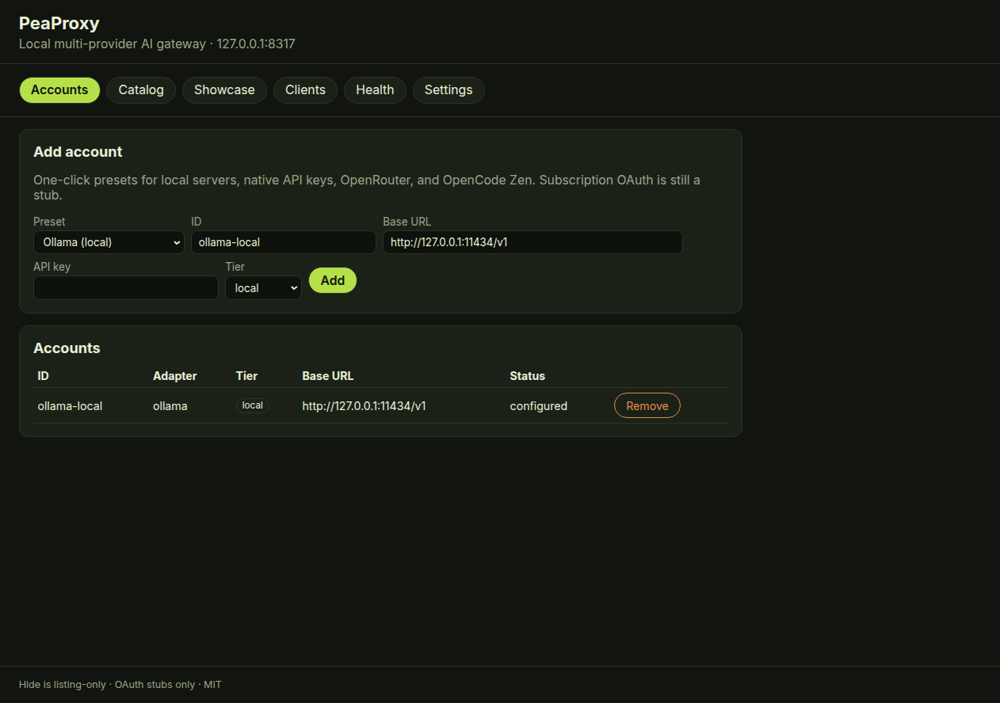
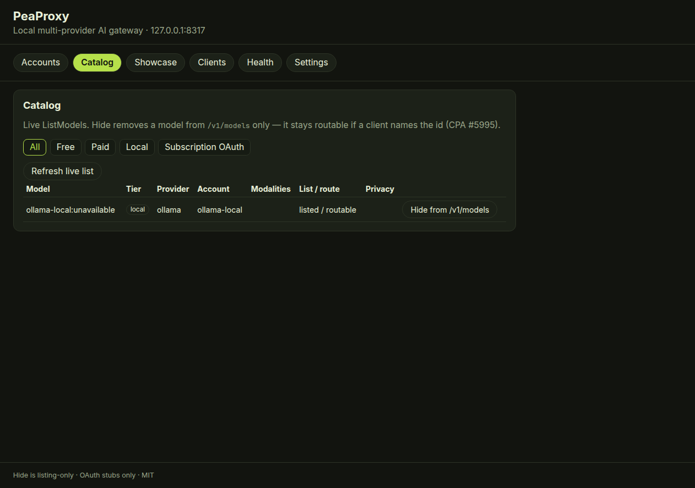
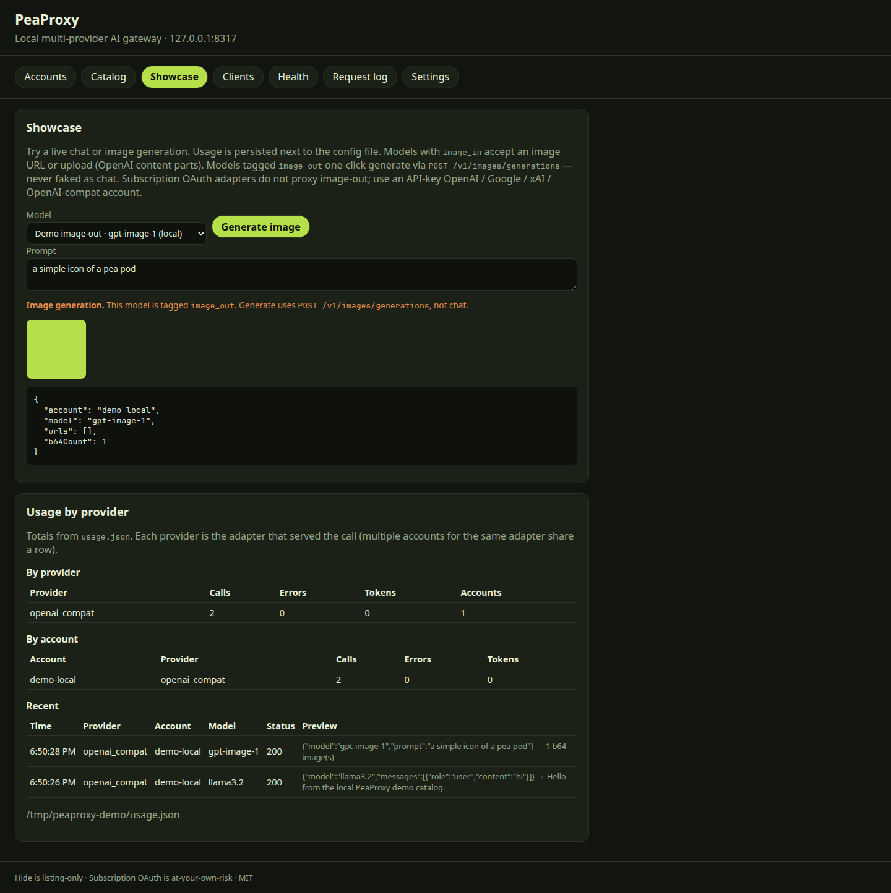
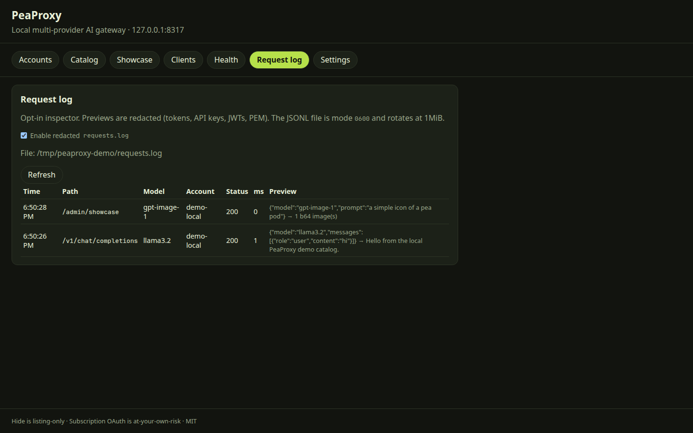
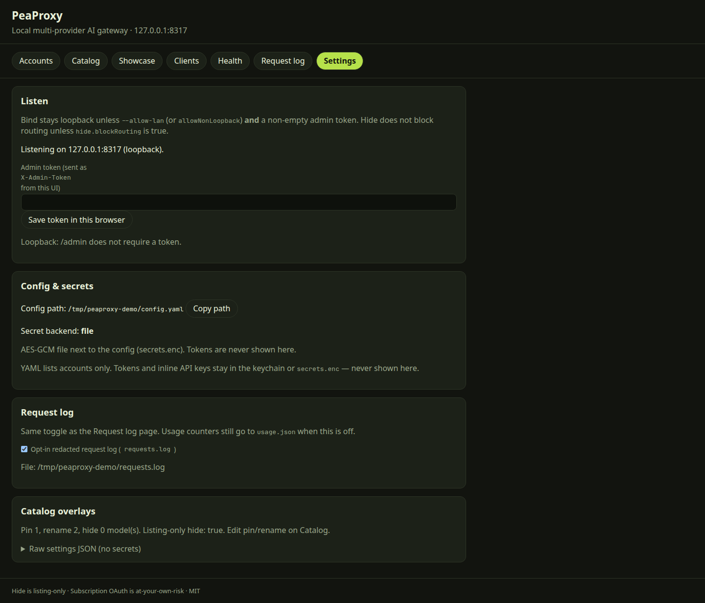
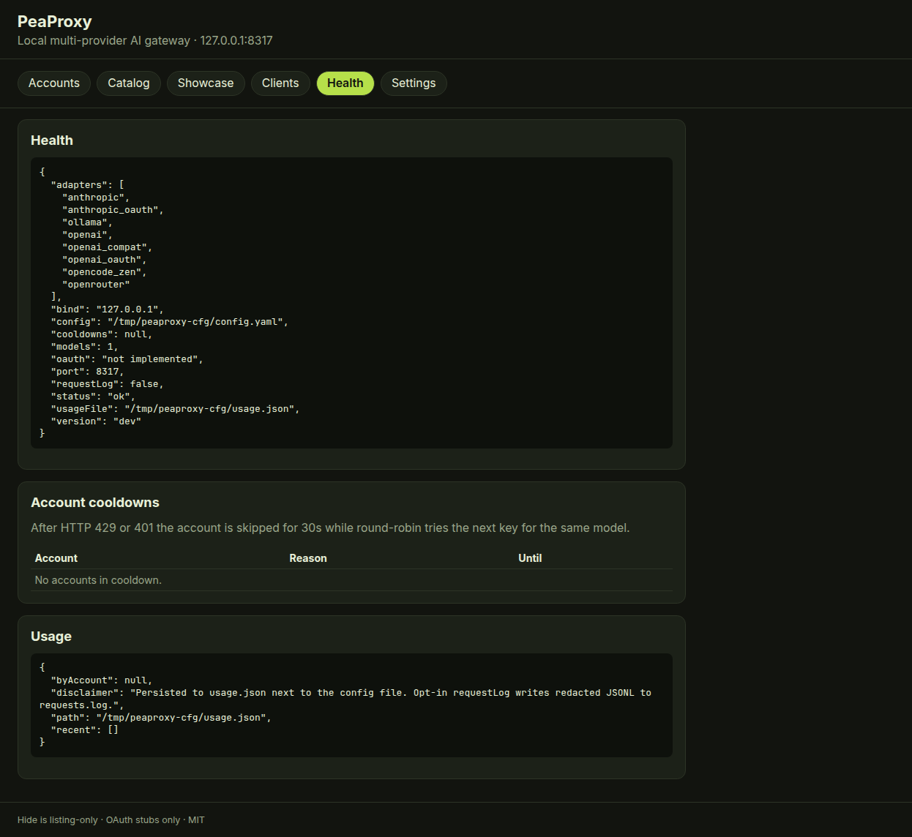

# PeaProxy

Local multi-provider AI gateway in Go: **API keys + free/local providers + subscription OAuth** (Claude, Codex, Gemini/Antigravity, xAI, Kimi, Meta Muse, GitHub Copilot). OpenAI-, Claude-, and Responses-shaped localhost endpoints, a **live model catalog** (no hand-maintained allowlist), a CLI, and a browser UI.

Status: **v2.0.8** on main. Schema stays 1. Request-engine behavior is in [docs/V2.md](docs/V2.md).

**Liability:** subscription OAuth **may violate provider terms** and can ban the account. PeaProxy authors are **not liable**. The official path is an **API key**. Details: [docs/OAUTH.md](docs/OAUTH.md).

## Keys vs OAuth

| Path | When | Risk |
|---|---|---|
| **API key** (`anthropic`, `openai`, `google`/`gemini`, `xai`, Groq, …) | Official provider console / AI Studio | Supported. Prefer this. |
| **Local / no key** (Ollama, LM Studio, llama.cpp, vLLM, Jan, GPT4All) | Software you already run | Supported. |
| **Subscription OAuth** (`peaproxy auth login --provider …`) | Reuse a Claude Pro/Max, ChatGPT/Codex, Gemini/Antigravity, xAI, Kimi, Meta Muse, or GitHub Copilot subscription | **ToS/ban risk. At your own risk.** Authors not liable. |
| **Qwen consumer OAuth** | — | **Not yet** (no CPA flow). Use a Qwen **API key** with `openai_compat`. |
| **Factory / Droid upstream** | — | **Not yet** (no public consumer chat OAuth). Use **Droid as a client** of PeaProxy. |
| **OpenCode Go** | Subscribe at [opencode.ai/auth](https://opencode.ai/auth) | Official **API key** (`adapter: opencode_go`). Distinct from Zen. Not OAuth. |

OAuth presets in the UI print the same warning. Tokens and inline keys go to the **OS keychain** (encrypted file fallback), not plaintext YAML.

## One-liner

Point coding tools at one local OpenAI-shaped, Claude-shaped, and Responses endpoint. Use keys and local runtimes first; optionally attach subscription OAuth **at your own risk**; fail over on 429/401.

## Install

Homebrew (macOS / Linux):

```bash
brew tap ks1686/tap
brew install --cask peaproxy
peaproxy --version
peaproxy serve
```

Alternatively, follow `main` with Go `@latest`, or pin the tag:

```bash
go install github.com/ks1686/peaproxy/cmd/peaproxy@latest
# or pin a tag, e.g. @v2.0.8
peaproxy --version
peaproxy serve
```

Requires Go 1.22+ for `go install`. Tagged releases (`v*`) also publish linux/darwin/windows **amd64 + arm64** binaries via GoReleaser ([GitHub Releases](https://github.com/ks1686/peaproxy/releases)). macOS GitHub Release / Homebrew cask binaries are Developer ID signed and notarized ([docs/RELEASING.md](docs/RELEASING.md)).

```bash
go run ./cmd/peaproxy serve   # from a clone
```

Open http://127.0.0.1:8317/



First-run **Accounts** — local / API-key onboarding CTAs first. Subscription OAuth is last-resort (**ToS/ban risk**; authors are not liable).



**Catalog** — live `ListModels` with pin/rename overlays. `image_out` is a modality tag on the row (here `gpt-image-1`).



**Showcase** — `image_out` one-click generate via `POST /v1/images/generations` (never faked as chat). The lime square is a throwaway mock upstream, not a photoreal generator.



**Request log** — opt-in redacted inspector (`requestLog: true` or the Settings / Request log toggle).



**Settings** — loopback bind, secret backend, request-log toggle, catalog overlay counts. Tokens and API keys are not shown.



**Health** — adapter `ListModels` status and cooldown overlay.

Captured from live `peaproxy serve` plus a local OpenAI-compat mock (`scripts/capture-readme-screenshots.mjs`). No API keys or OAuth tokens appear in the images.

## Feature matrix (2.0.x)

| Capability | Status |
|---|---|
| Live catalog, hide ≠ route, pin/rename overlays | Shipped. `routes:` are stable local names that rewrite to a live id; pin/rename stay listing-only |
| `POST /v1/chat/completions` stream + non-stream | Shipped; translated SSE emits `finish_reason` before `[DONE]`. Cross-wire thinking/reasoning is `reasoning_opaque` on the assistant message (stripped before OpenAI-compat upstreams) |
| `POST /v1/messages` true Anthropic SSE | Shipped. Translated streams (non-Claude models) carry usage, stream tool calls as `tool_use` blocks, and report `max_tokens` on truncation |
| `POST /v1/responses` (Codex native or translated) | Shipped — Codex OAuth is a tools surface (pass-through); other adapters round-trip function tools via chat, without executing them |
| Vision-in Showcase (URL / upload) | Shipped |
| Image-out / `POST /v1/images/generations` and `/v1/images/edits` | **Shipped** for API-key OpenAI-compat when the catalog tags `image_out`. Showcase generates. OAuth adapters refuse clearly (no fake chat) |
| Embeddings / `POST /v1/embeddings` | **Shipped** for API-key OpenAI-compat when the catalog tags `embeddings`. Showcase can try. OAuth / Messages-only adapters refuse clearly (no fake vectors) |
| Quota remaining | **Shipped** when the provider reports it (rate-limit headers; OpenRouter `GET /key`). Unknown remaining is omitted, never invented as 0 or unlimited |
| API keys + custom OpenAI-compat | Shipped |
| Free/local presets (Ollama, LM Studio, llama.cpp, vLLM, Jan, GPT4All, Groq, Cerebras, HF, NIM, Workers AI, Ollama Cloud, SambaNova, Zen, OpenRouter) | Shipped |
| Subscription OAuth (Claude, Codex, Gemini/Antigravity, xAI, Kimi, Muse, Copilot) | Shipped, **ToS/ban risk**. Antigravity supports tool calling both ways |
| Claude OAuth Messages cloak | **Shipped** — `anthropic_oauth` injects Claude Code billing header + CLI identity (caller system relocated, never deleted). Client-preset cloak defaults stay **off** |
| Codex OAuth `store` / token limits | **Shipped** — `openai_oauth` forces `store: false` and omits `max_output_tokens` / `stream_options` |
| Qwen consumer OAuth | **Not yet** — use an API key |
| Factory / Droid chat upstream | **Not yet** — Droid is a **client** preset |
| OpenCode Go | Shipped as API key (`opencode_go`, distinct from Zen) |
| OS keychain / `secrets.enc` | Shipped. Large OAuth tokens are stored as chunked keychain items |
| 429/401 failover + cooldown skip + Health | Shipped (`round-robin` / `fill-first` / `sticky`). Session affinity keeps one conversation on one account until it cools (default on, 1h). Cooldown length follows the provider's reset hint; the 503 names the account and cause; a slow first token never starts a cooldown |
| Harness presets + `clients verify --chat` | Shipped (Cursor, Claude Code, OpenCode, Pi, Codex, Continue, Cline, Amp, Droid) |
| Settings, onboarding CTAs, `config validate` | Shipped |
| CLI `catalog` / `health` / `requests` / `accounts add` | Shipped |
| Homebrew cask + signed/notarized macOS binaries | Shipped (`brew tap ks1686/tap`) |
| Loopback default; LAN needs token | Shipped |
| macOS / Windows tray | **No, by design** (CLI + localhost UI) |
| Claude OAuth through Cloudflare | Stock Go TLS; may **403**. Prefer API key. No uTLS. |

Adapters and URLs: [docs/PROVIDERS.md](docs/PROVIDERS.md). Plan phases: [docs/PLAN.md](docs/PLAN.md).

## Quick start

1. **Accounts** — pick a preset. Official **API key** and **local** presets first. OAuth presets show a ban-risk warning. Workers AI needs an account id (`CLOUDFLARE_ACCOUNT_ID`). Presets show the env var **name** they expect and whether it is set (never the value).
2. **Catalog** — live `ListModels`. Hide is listing-only (CPA #5995). Optional pin/rename. Filters persist in the UI.
3. **Showcase** — try a prompt; `image_in` models accept an image URL or upload. `image_out` one-click generates via `/v1/images/generations` when the account can proxy it. `embeddings` models try via `/v1/embeddings`.
4. **Request log** — opt-in redacted inspector (`requestLog: true` or the UI toggle).
5. Point Cursor / OpenCode / Claude Code / Pi / Continue / Cline / Amp / Droid at the local base URL (`peaproxy clients show …`).

```bash
curl -s http://127.0.0.1:8317/v1/models
curl -s http://127.0.0.1:8317/v1/chat/completions \
  -H 'Content-Type: application/json' \
  -d '{"model":"llama3.2","messages":[{"role":"user","content":"hi"}]}'
curl -s http://127.0.0.1:8317/v1/messages \
  -H 'Content-Type: application/json' \
  -d '{"model":"llama3.2","max_tokens":32,"stream":true,"messages":[{"role":"user","content":"hi"}]}'
curl -s http://127.0.0.1:8317/v1/images/generations \
  -H 'Content-Type: application/json' \
  -d '{"model":"dall-e-3","prompt":"a pea pod icon"}'
curl -s http://127.0.0.1:8317/v1/embeddings \
  -H 'Content-Type: application/json' \
  -d '{"model":"text-embedding-3-small","input":"hello pea"}'
peaproxy clients show cursor
peaproxy clients show opencode   # includes /v1
peaproxy clients show claude-code  # does NOT include /v1
peaproxy clients show pi         # both wires; cloak off
peaproxy clients show codex      # Responses API (wire_api = responses)
peaproxy clients show amp        # Custom URL, not amp.url
peaproxy clients show droid      # Factory Droid BYOK client
peaproxy clients verify cursor --chat
```

First `serve` writes `~/.config/peaproxy/config.yaml` if missing. Example: [configs/peaproxy.example.yaml](configs/peaproxy.example.yaml). Env overlays: [docs/CONFIG.md](docs/CONFIG.md). Usage is `usage.json` next to the config: a 200-event ring plus 90 UTC days of per-account totals. Tokens and price are recorded only when the provider publishes them.

| Command | Purpose |
|---|---|
| `serve` | Listen `127.0.0.1:8317` + UI (writes first-run config) |
| `--version` / `-v` | Release tag (`go install …@vX.Y.Z` or GoReleaser). Dirty local trees print `dev` |
| `auth` | Subscription OAuth (`--provider anthropic\|openai\|gemini\|xai\|kimi\|kimi-ai\|meta\|copilot`). Prints ToS/ban-risk warning. `--print-url` / `--device` / `--no-browser`. Prefer API keys. Qwen and Factory are **not yet**. OpenCode Go is an API key (`--provider opencode-go` explains). |
| `accounts` | Configured provider accounts (`list` / `add <preset>`) |
| `models` | Live catalog (`--filter all\|free\|paid\|local\|subscription_oauth`) |
| `catalog` | Listing overlays (`pin` / `rename` / `hide`) matching the Catalog UI |
| `requests` | Opt-in inspector (`tail` when `requestLog` is on) |
| `health` | Adapter health / quota remaining / cooldowns matching `GET /admin/health` |
| `status` | Bind / config path / version |
| `config` | `path` / `show` / `validate` / `init` |
| `clients` | Harness presets (`list` / `show` / `verify [--chat]`) |

## HTTP

| Path | Status |
|---|---|
| `GET /v1/models` | Live list; hide/expose affect **listing only** |
| `GET /v0/catalog` | Rich catalog (tier, modalities, privacy, hidden/routable) |
| `POST /v1/chat/completions` | Stream + non-stream; failover on retryable status/bodies; cooled accounts are not re-hit (503 + Retry-After); translated SSE emits `finish_reason` before `[DONE]` |
| `POST /v1/messages` | Native Anthropic SSE or translated OpenAI stream (true events, not a single-event wrapper) |
| `POST /v1/responses` | Codex / OpenAI Responses: native tools pass-through for Codex OAuth (`store: false`; omit `stream_options` / `max_output_tokens`); other adapters round-trip function tools via chat |
| `POST /v1/images/generations` and `/v1/images/edits` | OpenAI Images API for models tagged `image_out`; refused (no chat fake) otherwise |
| `POST /v1/embeddings` | OpenAI Embeddings API for models tagged `embeddings`; refused (no chat fake) otherwise |
| `GET /` | UI: Accounts, Catalog, Showcase, Clients, Health, Request log, Settings |
| `GET /healthz` | Liveness (includes LAN warning flags; no admin token) |
| `GET /admin/health` | Bind, **adapter health**, **quota remaining** (null/omitted when unknown), **account cooldowns** with remaining time (token required off loopback) |
| `GET /admin/quota` | Per-account quota remaining plus the provider honesty matrix |
| `POST /admin/health/probe` | Re-run `Validate` on each adapter and documented quota probes |
| `GET /admin/presets` | Account dropdown templates (env var **names** and whether they are set; never values) |
| `GET /admin/usage` | Persisted usage (`usage.json`): recent ring plus daily rollups |
| `GET /admin/requests` | Opt-in redacted request inspector (`requests.log`) |
| `POST /admin/catalog/overlay` | Pin / rename a live model id (listing overlay only) |

## Gemini

Google AI Studio is the **official OpenAI-compat Gemini API** (`https://generativelanguage.googleapis.com/v1beta/openai`), not `generateContent`. Adapter ids: `google` and alias `gemini`. Subscription Gemini/Antigravity OAuth is a **different** adapter (`antigravity`) with ToS risk. Docs: [PROVIDERS.md](docs/PROVIDERS.md).

## Why this exists

VibeProxy and CLIProxyAPI spend a lot of issue tracker time on:

1. **Auto model discovery** — stop the “add model X” treadmill.
2. **Failover that works** — quota/429 → next credential without hand-disabling accounts.
3. **Harness fidelity** — Pi cloak defaults off, thinking injection, Cursor tools, Amp/Codex `stream_options`, Continue YAML / Cline `/v1`.
4. **Secure localhost default** — `127.0.0.1:8317`, not `*:8317`.
5. **UI without a macOS tray** — CLI + browser only, **by design**.
6. **Catalog hide ≠ routing** — listing-only exclusion (CPA #5995 still open upstream).
7. **Prompt-cache-safe JSON** — never reshuffle keys with Go maps (VibeProxy #292).
8. **Free + custom providers** — including OpenCode Zen (CPA declined #6018).
9. **Built-in usage / showcase** — CPA removed usage in v6.10+.

What PeaProxy actually ships vs still residual: [docs/COMPETITOR-WINS.md](docs/COMPETITOR-WINS.md). Also [docs/PLAN.md](docs/PLAN.md), [docs/PROVIDERS.md](docs/PROVIDERS.md), [docs/HARNESS.md](docs/HARNESS.md), [docs/CONFIG.md](docs/CONFIG.md), [docs/OAUTH.md](docs/OAUTH.md), [docs/V1.md](docs/V1.md), [docs/V2.md](docs/V2.md), [docs/COMPATIBILITY.md](docs/COMPATIBILITY.md), [docs/RELEASING.md](docs/RELEASING.md).

## Security

- Default bind is **loopback**. Binding `0.0.0.0` requires `--allow-lan` **and** a non-empty admin token (`docs/CONFIG.md`).
- Never log secrets. Opt-in request log is redacted. OAuth tokens and inline API keys are stored in the OS keychain (macOS Keychain, Windows Credential Manager, Linux Secret Service) or an AES-GCM file next to the config when no keychain is available. YAML lists accounts without printing those secrets.
- **ToS:** **Subscription OAuth** (Claude Pro/Max, ChatGPT/Codex, Gemini/Antigravity, xAI, Kimi, Meta Muse) may violate a provider’s terms and can result in account bans. PeaProxy authors are **not liable**. Prefer official API keys. OpenCode Zen **free** models may train on prompts — see catalog privacy notes and [OpenCode Zen docs](https://opencode.ai/docs/zen/). Details: [docs/OAUTH.md](docs/OAUTH.md).
- **GitHub Models is retired** (2026-07-30) and is not a provider.

## License

[MIT](LICENSE)
